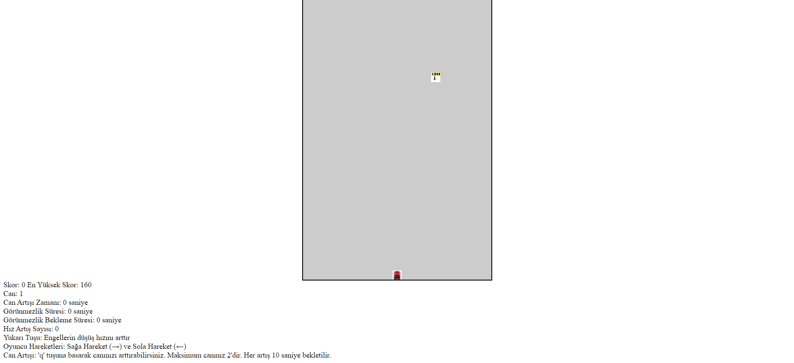
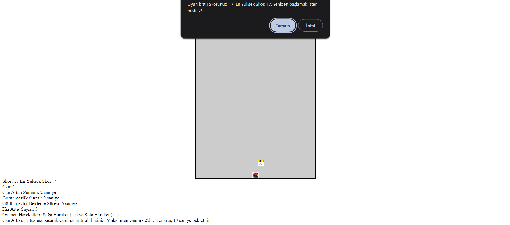

  Engel'den Kaçma Oyunu
  
Bu proje, basit bir engel kaçma oyununu JavaScript kullanarak oluşturur. Oyun, tarayıcıda oynanabilir ve oyuncunun engellerden kaçarak en yüksek skoru elde etmeye çalıştığı bir platformda geçer.

Nasıl Oynanır
Oyuna başladığınızda, oyuncu ortada başlar ve sağa veya sola hareket edebilir.
Engeller yukarıdan aşağıya doğru hareket ederken, oyuncunun engellere çarpmadan kaçması gerekir.
Engellere çarpmadan ne kadar süreyle hayatta kalırsanız, skorunuz o kadar artar.
Oyuncunun canı sınırlıdır. Herhangi bir engelle temas, oyuncunun canını azaltır. Can sıfırlanırsa, oyun biter.
Oyun sırasında belirli etkinliklerle oyuncunun canı artırılabilir veya görünmezlik özelliği kullanılabilir.
Oyun sırasında yukarı ok tuşuna basarak engellerin düşüş hızını artırabilirsiniz.

Kurulum
Bu projeyi bilgisayarınıza klonlayın veya indirin.
İndirdiğiniz klasörde bulunan "index.html" dosyasını bir web tarayıcısıyla açarak oyunu başlatın.

Bu README dosyası, projenin nasıl oynanacağı ve kurulum talimatları içerir. İlgili bölümleri kendi projenize göre özelleştirebilirsiniz.

 
